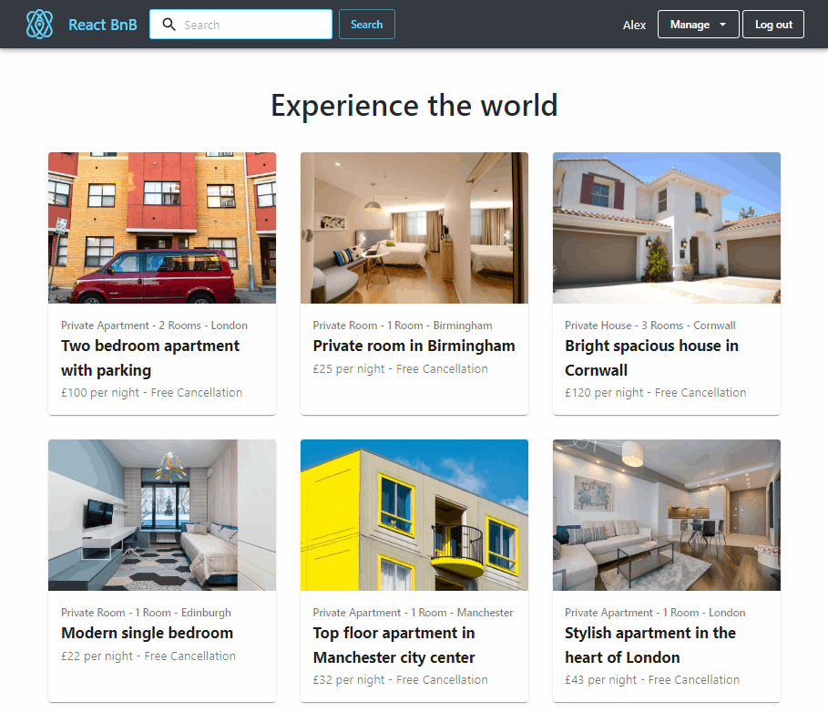

# React-BnB Property Rentals  

An "Airbnb-like" online marketplace for room and property rentals created using TypeScript, React, Redux, Express and Node.JS.

**Live Demo - https://react-bnb.herokuapp.com/**

---

## Libraries and Tech-stack:
- **Material UI** - Consistent theming and React form/layout components.
- **Redux** - UI state management.
- **MongoDB Cloud** - Hosting and managing the project database in the cloud.
- **Cloudinary** - Platform for hosting project media and rental images.
- **JSON Web Tokens** - Format for user login session credentials.
- **Heroku** - Convenient deployment and hosting of the project instance.
- **TomTom API** - Displaying rental location using maps.

## Features:
- Fully responsive design for mobile/desktop support.
- User registration and login sessions.
- Create and manage calendar bookings and rental locations.
- Rental image upload with cloud storage.
- Searching for available rentals by location.
- Displaying rental location on a map interface.
- Developed using React Hooks for a more modern functional component design.